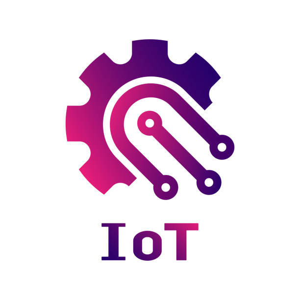

# 🌆 Futurópolis - Smart City IoT 3D

[](https://reactjs.org/)
[](https://www.typescriptlang.org/)
[](https://threejs.org/)
[](LICENSE)

> Una ciudad inteligente interactiva en 3D que demuestra el poder del Internet de las Cosas (IoT) para mejorar la calidad de vida urbana.



## 🎯 Descripción

**Futurópolis** es una aplicación web 3D interactiva que simula una ciudad inteligente equipada con 42 sensores IoT de 6 tipos diferentes. Los usuarios pueden explorar la ciudad, interactuar con sensores y visualizar datos en tiempo real que demuestran cómo la tecnología IoT puede transformar espacios urbanos.

### ✨ Características Principales

- 🏙️ **Ciudad 3D Completa** - Edificios, calles, árboles, vehículos y personas
- 🔴 **8 Sensores de Tráfico** - Monitoreo de flujo vehicular
- 🟡 **8 Sensores de Iluminación** - Control inteligente de alumbrado
- 🔵 **8 Sensores de Calidad del Aire** - Monitoreo ambiental
- 🟠 **6 Sensores de Temperatura** - Datos climáticos urbanos
- 🟢 **8 Sensores de Residuos** - Gestión inteligente de basura
- 🟣 **4 Sensores de Seguridad** - Vigilancia y monitoreo
- 🎮 **Controles Intuitivos** - Navega con flechas y mouse
- 📊 **Datos en Tiempo Real** - Información detallada de cada sensor

## 🚀 Demo en Vivo

[**Ver Demo**](http://localhost:3000) _(Ejecutar localmente)_

## 📦 Instalación

### Requisitos Previos

- Node.js 16+ y npm
- Navegador moderno con soporte WebGL 2.0
- 4GB RAM mínimo

### Pasos de Instalación

```bash
# Clonar el repositorio
git clone https://github.com/tu-usuario/futoropolis.git
cd futoropolis

# Instalar dependencias
npm install

# Iniciar servidor de desarrollo
npm run dev
```

La aplicación estará disponible en `http://localhost:3000`

## 🎮 Controles

### Teclado
- **⬆️ Flecha Arriba** - Mover adelante
- **⬇️ Flecha Abajo** - Mover atrás
- **⬅️ Flecha Izquierda** - Mover izquierda
- **➡️ Flecha Derecha** - Mover derecha
- **SHIFT** - Correr
- **C** - Cambiar modo cámara

### Mouse
- **Clic Izquierdo (Sensor)** - Ver información
- **Clic Derecho (Suelo)** - Mover personaje
- **Scroll** - Zoom (modo libre)
- **Arrastrar** - Rotar cámara (modo libre)

## 🏗️ Arquitectura

```
src/
├── App.tsx                      # Componente principal con escena 3D
├── main.tsx                     # Punto de entrada de la aplicación
├── components/
│   ├── IoT/
│   │   └── SensorManager.ts    # Gestión de sensores IoT
│   └── UI/
│       ├── HUD.tsx             # Interfaz superior
│       ├── EducationalPanel.tsx # Panel educativo
│       └── SensorPanel.tsx     # Panel de estado de sensores
└── styles/
    └── main.css                # Estilos globales
```

## 🔧 Tecnologías Utilizadas

### Frontend
- **React 18.2.0** - Framework de UI
- **TypeScript 5.3.3** - Tipado estático
- **Three.js 0.159.0** - Renderizado 3D
- **Webpack 5.103.0** - Empaquetador de módulos

### Protocolos IoT (Documentación)
- MQTT - Comunicación ligera
- HTTP/REST - API de datos
- WebSocket - Tiempo real
- LoRaWAN - Largo alcance

## 📊 Sensores Implementados

| Tipo | Cantidad | Color | Función |
|------|----------|-------|---------|
| Tráfico | 8 | 🔴 Rojo | Flujo vehicular |
| Iluminación | 8 | 🟡 Amarillo | Alumbrado público |
| Calidad Aire | 8 | 🔵 Cyan | Contaminación |
| Temperatura | 6 | 🟠 Naranja | Clima urbano |
| Residuos | 8 | 🟢 Verde | Gestión basura |
| Seguridad | 4 | 🟣 Morado | Vigilancia |

## 💡 Características Técnicas

### Optimizaciones de Rendimiento
- Geometrías simplificadas (6-8 segmentos)
- Sombras selectivas
- PixelRatio limitado a 1.5
- Objetos reducidos estratégicamente
- 45-60 FPS promedio

### Datos de Sensores
Cada sensor muestra información específica:

**Tráfico:**
- Vehículos/hora
- Tiempo promedio
- Nivel de congestión

**Iluminación:**
- Intensidad lumínica
- Consumo energético (kW)
- Modo nocturno

**Calidad Aire:**
- PM2.5 (μg/m³)
- CO2 (ppm)
- Índice de calidad

**Temperatura:**
- Temperatura (°C)
- Humedad (%)
- Presión (hPa)

**Residuos:**
- Nivel de llenado (%)
- Porcentaje reciclaje
- Próxima recolección

**Seguridad:**
- Cámaras activas
- Accesos monitoreados
- Estado del sistema

## 🔮 Roadmap

### Fase 2 (Q1 2026)
- [ ] Backend Node.js + Express
- [ ] Base de datos MongoDB
- [ ] API REST completa
- [ ] Autenticación de usuarios

### Fase 3 (Q2 2026)
- [ ] Conexión con hardware real (ESP32, Arduino)
- [ ] Machine Learning para predicciones
- [ ] Dashboard administrativo
- [ ] App móvil (React Native)

### Fase 4 (Q3 2026)
- [ ] IA para optimización automática
- [ ] Realidad Aumentada (AR)
- [ ] Gemelo digital completo
- [ ] Blockchain para transparencia

## 🤝 Contribuir

Las contribuciones son bienvenidas! Por favor:

1. Fork el proyecto
2. Crea una rama (`git checkout -b feature/NuevaCaracteristica`)
3. Commit tus cambios (`git commit -m 'Agregar nueva característica'`)
4. Push a la rama (`git push origin feature/NuevaCaracteristica`)
5. Abre un Pull Request

## 📝 Scripts Disponibles

```bash
# Desarrollo
npm run dev          # Inicia servidor de desarrollo

# Producción
npm run build        # Genera build de producción
npm run serve        # Sirve build de producción

# Utilidades
npm run lint         # Ejecuta linter
npm run test         # Ejecuta tests (cuando estén disponibles)
```

## 🐛 Problemas Conocidos

- [ ] Rendimiento reducido en dispositivos móviles antiguos
- [ ] Carga inicial puede tardar 3-5 segundos
- [ ] Safari puede tener problemas con shadows

## 📄 Licencia

Este proyecto está bajo la Licencia MIT - ver el archivo [LICENSE](LICENSE) para detalles.

## 👨‍💻 Autor

**Tu Nombre**
- GitHub: [@tu-usuario](https://github.com/tu-usuario)
- Email: tu-email@ejemplo.com

## 🙏 Agradecimientos

- Comunidad de Three.js por la excelente documentación
- React Team por el framework
- Todos los contribuidores del proyecto

## 📚 Documentación Adicional

- [Documentación Completa del Foro](./DOCUMENTACION_FORO.md)
- [Guía de Arquitectura IoT](./docs/arquitectura-iot.md) _(próximamente)_
- [Tutorial de Desarrollo](./docs/tutorial.md) _(próximamente)_

---

**⭐ Si este proyecto te fue útil, considera darle una estrella en GitHub!**

Hecho con ❤️ para mejorar las ciudades del futuro
